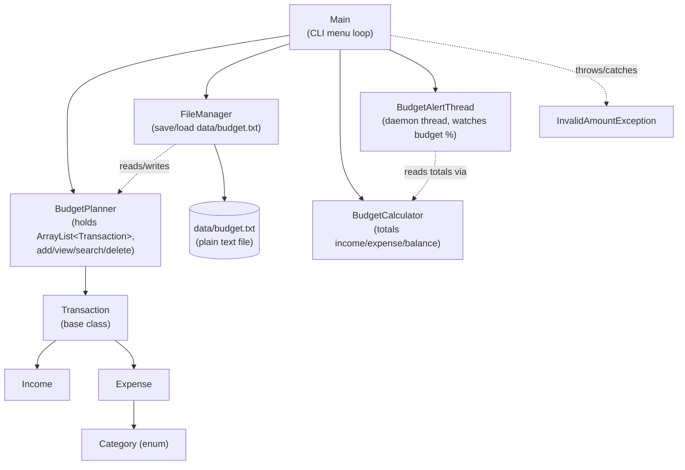

# System Architecture

Budget Planner is a single-process command-line application. `Main` drives the menu
loop and delegates all real work to a small set of supporting classes, each with one
clear responsibility.

## Layer Responsibilities
- **Main** — the only class that talks to the user (via `Scanner`/`System.out`);
  reads menu choices and calls into the other classes.
- **BudgetPlanner** — the in-memory model of the current session's transactions.
- **Transaction / Income / Expense / Category** — the data model, using inheritance
  to represent two kinds of transaction and an enum to constrain valid categories.
- **BudgetCalculator** — pure calculation logic (totals, balance), kept separate
  from both the menu and the data so it can be reused or tested independently.
- **FileManager** — the only class that touches the file system, isolating the
  storage format from the rest of the application.
- **BudgetAlertThread** — runs independently of the main thread, periodically
  checking spend against the configured limit without blocking the CLI.
- **InvalidAmountException** — a custom checked exception used to reject
  zero/negative amounts at the point of entry.
