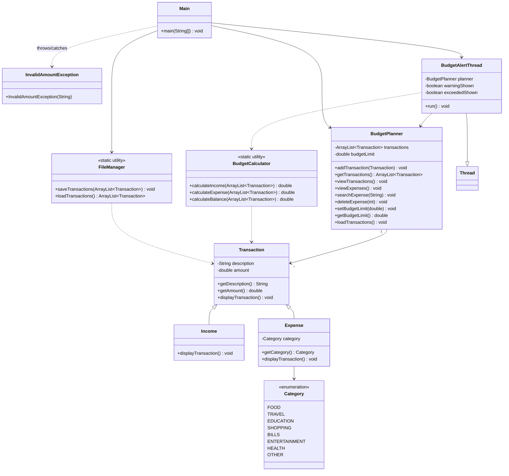

# Class Diagram

```mermaid
classDiagram
    class Transaction {
        -String description
        -double amount
        +getDescription() String
        +getAmount() double
        +displayTransaction() void
    }
    class Income {
        +displayTransaction() void
    }
    class Expense {
        -Category category
        +getCategory() Category
        +displayTransaction() void
    }
    Transaction <|-- Income
    Transaction <|-- Expense

    class Category {
        <<enumeration>>
        FOOD
        TRAVEL
        EDUCATION
        SHOPPING
        BILLS
        ENTERTAINMENT
        HEALTH
        OTHER
    }
    Expense --> Category

    class BudgetPlanner {
        -ArrayList~Transaction~ transactions
        -double budgetLimit
        +addTransaction(Transaction) void
        +getTransactions() ArrayList~Transaction~
        +viewTransactions() void
        +viewExpenses() void
        +searchExpense(String) void
        +deleteExpense(int) void
        +setBudgetLimit(double) void
        +getBudgetLimit() double
        +loadTransactions() void
    }
    BudgetPlanner "1" --> "*" Transaction

    class BudgetCalculator {
        <<static utility>>
        +calculateIncome(ArrayList~Transaction~) double
        +calculateExpense(ArrayList~Transaction~) double
        +calculateBalance(ArrayList~Transaction~) double
    }
    BudgetCalculator ..> Transaction

    class FileManager {
        <<static utility>>
        +saveTransactions(ArrayList~Transaction~) void
        +loadTransactions() ArrayList~Transaction~
    }
    FileManager ..> Transaction

    class InvalidAmountException {
        +InvalidAmountException(String)
    }
    Main ..> InvalidAmountException : throws/catches

    class BudgetAlertThread {
        -BudgetPlanner planner
        -boolean warningShown
        -boolean exceededShown
        +run() void
    }
    BudgetAlertThread --|> Thread
    BudgetAlertThread --> BudgetPlanner
    BudgetAlertThread ..> BudgetCalculator

    class Main {
        +main(String[]) void
    }
    Main --> BudgetPlanner
    Main --> FileManager
    Main --> BudgetAlertThread
```
