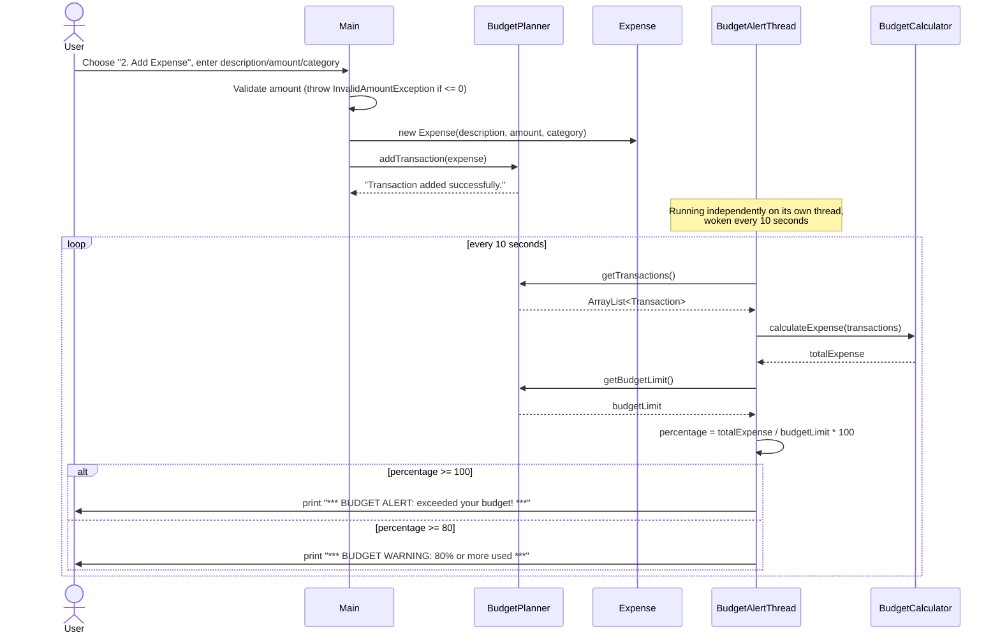

# Sequence Diagram — Adding an Expense &amp; Budget Alert

This traces what actually happens when a user picks "2. Add Expense" from the menu,
and how the independently-running `BudgetAlertThread` reacts afterward.

