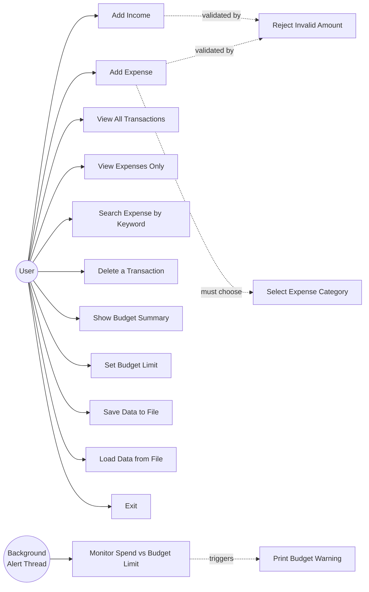

# Use Case Diagram

## Actors
- **User** — the person running the CLI; performs all the transaction, budgeting,
  and file operations through the numbered menu.
- **Background Alert Thread** — not a human actor, but a second thread of execution
  that acts autonomously within the system, independent of the user's menu choices.
