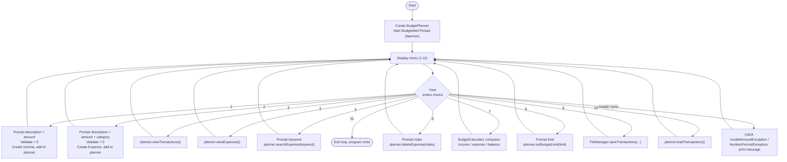

# Process Flow / Workflow Diagram

```mermaid
flowchart TD
    Start([Start]) --> Init["Create BudgetPlanner<br/>Start BudgetAlertThread (daemon)"]
    Init --> Menu["Display menu (1-11)"]
    Menu --> Choice{"User<br/>enters choice"}

    Choice -->|1| AddIncome["Prompt description + amount<br/>Validate > 0<br/>Create Income, add to planner"]
    Choice -->|2| AddExpense["Prompt description + amount + category<br/>Validate > 0<br/>Create Expense, add to planner"]
    Choice -->|3| ViewAll["planner.viewTransactions()"]
    Choice -->|4| ViewExpenses["planner.viewExpenses()"]
    Choice -->|5| Search["Prompt keyword<br/>planner.searchExpense(keyword)"]
    Choice -->|6| Delete["Prompt index<br/>planner.deleteExpense(index)"]
    Choice -->|7| Summary["BudgetCalculator computes<br/>income / expense / balance"]
    Choice -->|8| SetLimit["Prompt limit<br/>planner.setBudgetLimit(limit)"]
    Choice -->|9| Save["FileManager.saveTransactions(...)"]
    Choice -->|10| Load["planner.loadTransactions()"]
    Choice -->|11| Exit(["Exit loop, program ends"])
    Choice -->|invalid / error| Caught["Catch InvalidAmountException /<br/>NumberFormatException, print message"]

    AddIncome --> Menu
    AddExpense --> Menu
    ViewAll --> Menu
    ViewExpenses --> Menu
    Search --> Menu
    Delete --> Menu
    Summary --> Menu
    SetLimit --> Menu
    Save --> Menu
    Load --> Menu
    Caught --> Menu
```
